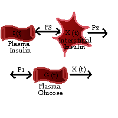

```{r setup, include = FALSE}
knitr::opts_chunk$set(
  warning = FALSE,
  message = FALSE,
  cache = FALSE
)
```
```{r}
library(knitr)
library(tidyverse)
library(DT) # table beautification
library(plotly)
library(deSolve)
# tinytex::install_tinytex() to use LaTeX in Rmd
library(minpack.lm)
library(reshape2)
```

### The following analysis involves study of Bergman Minimal Model from J. Clin. Invest.
*Physiologic Evaluation of Factors Controlling Glucose Tolerance in Man (Richard N. Bergman, Lawrence S. Phillips, and Claudio Cobelli,1981)* [PMID:  7033284](https://www.ncbi.nlm.nih.gov/pmc/articles/PMC370948/)

### Data Used
[Glucose Insulin Kinetics from Civilized Software Inc. MLAB Technical Application Notes](https://www.civilized.com/mlabexamples/glucose.htmld/)

## Brief introduction to Bergman Minimal Model
The model consists of the combination of the Minimal Model of Glucose Disappearance and Minimal Model of Insulin Kinetics.
The minimal model for glucose and insulin was developed by Dr. Richard N. Bergman and co-workers for the data from the frequently sampled intravenous glucose tolerance(FSIGT) test which detects the glucose and insulin in plasma of dogs and insulin.

In a FSIGT test, the blood samples are collected from a fasting subject at a regular time interval, following a single intravenous injection of glucose.

```{r}
model_data = read.csv("glucose_insulin_profile_data.csv", header = TRUE)

datatable(model_data, options = list(scrollX = TRUE))
```
```{r,out.height="100%"}

plot(model_data$time, model_data$glucose, xlab = "Time(min.)", ylab = "Glucose level (mg/dl)", main="FSIGT data: Glucose level(mg/dl) vs time(min.)" )
abline(h=90,lty=2)

plot(model_data$time, model_data$insulin, xlab = "Time(min.)", ylab = "Insulin Level (μU/ml)",main="FSIGT data: Insulin Level (μU/ml) vs time(min.)" )
abline(h=7,lty=2)
```
<br>

We can observe here that the glucose level starts at a peak due to the injection, drops below the basal(pre-injection) level, and then slowly returns to the basal level.
The insulin also rapidly rises to a peak, drops to a lower level above basal, rises again to a smaller peak and then returns to basal level. 
Depending on the subject the number of secondary peak may vary in insulin levels and the glucose may not drop below the basal level.

As we discussed before there are two minimal models namely:
<ol>
<li>Minimal Model of Glucose Disappearance</li>
This model consists of two physiologic compartments:
<ul><li>the plasma</li><li>an interstitial tissue compartment</li></ul>
<li>Minimal Model of Insulin Kinetics</li>
Involves only a single plasma compartment
</ol>

The models allow us to characterize the FSIGT test data in terms of four indices:
<ul>
<li>$S_I=$ insulin sensitivity: a measure of dependence of fractional glucose dissapearance on plasma insulin</li>
<li>$S_G=$ glucose effectiveness: a measure of the fractional ability of glucose to lower its own concentration in plasma, independent of increased insulin</li>
<li>$\phi_1=$ first phase pancreatic responsivity: a measure of the size of the first peak in plasma insulin due to the glucose injection</li>
<li>$\phi_2=$ second phase pancreatic responsivity: a measure of the size of the second peak of plasma insulin which follows the first peak and the refractory period</li>

*To understand the model in a better manner let us look at each model independently*

## Minimal Model for Glucose kinetics
Let us understand the model through a diagram:
```{r, out.width="70%"} 

```
<br>
The differential equations explaining how the interstitial insulin level $X(t)$ and plasma glucose level $G(t)$ change over time are:
<br><br>
\[\frac{dX(t)}{dt} = -p_2 \cdot X(t) + p_3 \cdot (I(t)-I_b)\]
<br>
\[\frac{dG(t)}{dt} = -X(t)\cdot G(t) + p_1 \cdot (G_b-G(t))\]
<br><br>
Here $I_b$ and $G_b$ represent basal level of plasma insulin and glucose respectively. The basal plasma conc. are measured either before or 180 mins after administration of glucose.
<br>
With $G(0)=G_0$ and $X(0)=0$. Thus we have four unknown parameters in the model: $p_1$, $p_2$, $p_3$, and $G_0$.

In the model, glucose is utilized at a constant rate $p_1$, when we neglect the neglect the feedback effect due to interstitial insulin. <br>
The *insulin sensitivity* is defined as $S_I=\frac{p_3}{p_2}$ and the *glucose effectiveness* is defined as $S_G=p_1$.

From the <https://www.civilized.com/mlabexamples/glucose.htmld/> we can parse the unknown parameters for minimal glucose kinetics model: 
<ul>
<li>$p_1=0.02649256302$</li>
<li>$p_2=0.02543609572$</li>
<li>$p_3=1.281692067e-05$</li>
<li>$G_b=279.1123014$</li>
</ul>
Also the insulin sensitivity for the data set $S_I$ was estimated as $5.039 \times 10^{-4} min^{-1}\cdot (mU/ml)^{-1}$ which is within the normal range of $2.1$ to $18.2 \times10^{-4} min^{-1} \cdot(mU / ml)^{-1}$ mentioned in Steil et al.,1993. The glucose utilization $S_G$ for the data was estimated to be $0.0265 min^{-1}$ which is also within the normal range of $0.0026$ to $0.039 min^{-1}$ mentioned in Steil et al.,1993.

We still need to understand the minimal insulin model and get the differential equation for plasma insulin $I(t)$. Then we will solve all the differential equations together and plot the graphs.

## Minimal Model for Insulin Kinetics 
Similar to the glucose model, lets first look at the diagram:
```{r,out.width="70%"}

```
<br>
The differential equation for the minimal insulin model is:
\[
    \frac{dI(t)}{dt}= 
\begin{cases}
    -n \cdot I(t)+g\cdot(G(t)-h) \cdot t,& \text{if } G(t) \gt h\\
    -n\cdot I(t),              & \text{otherwise}
\end{cases}
\]
<br>
with $I(0)=I_0$.
$n$ is the insulin clearance fraction, $h$ is roughly the basal glucose plasma level, and $g$ is a measure of secondary pancreatic response to glucose. 
The first phase pancreatic responsivity is defined as 
$\phi_1=\frac{I_{max}-I_b}{n\cdot(G_0-G_b)}$
where $I_{max}$ is the maximum insulin response. 
The second phase pancreatic responsivity is defined as $\phi_2=g\times10^4$.

<ul>
<li>$n=0.2673230345$</li>
<li>$\gamma=0.004074459794$</li>
<li>$h=83.74403736$</li>
<li>$I_0=363.666326$</li>
<li>$\phi_1=3.46163989$</li>
<li>$\phi_2=40.7445979$</li>
</ul>

The phase 1 pancreatic responsivity, $\phi_1$, estimated as $3.462min\cdot(mU/ml)(mg/dl)^{-1}$ is within the normal range of 2.0 to 4.0. The phase 2 pancreatic responsivity,$\phi_2$, estimated as $40.745 min^{-2}\cdot(mU/ml)(mg/dl)^{-1}$, this is slightly higher than the normal range of 20 to 35.(Normal range as reported in Pacini et al., 1986)

Now let us combine these models finally and plot graphs.

## Combined Glucose-Insulin Model
Let us review the parameters/variables to be used in the combined model (Gallardo-Hernández et al., 2022):
```{r,out.width="100%"}

```
<br>
The parameters were parsed from the *Civilized Software Inc. MLAB Technical Application Notes* as done before.
<br>Note: the combined model parameters differ slightly from the parameters mentioned separately for glucose and insulin model. I have used the combined model parameters.
```{r}
min_model <- function (time, y, parms) {
with(as.list(c(y, parms)), {
  p1 = parms[1] 
  p2 = parms[2]
  p3 = parms[3]
  Gb = parms[4]
  Ib = parms[5]
  n = parms[6]
  g = parms[7]
  h = parms[8]
  X = y[1]
  G = y[2]
  I = y[3]
  dX <- -p2*X + p3*(I - Ib)
  dG <- (-X * G) + p1*(Gb - G)
  
  if(G > h){
    dI = (-n*I) + g*(G - h)*time
    list(c(dX,dG,dI))
    }else {
      dI = -n*I
      list(c(dX,dG,dI))
}
})
}


## initial values for X,G,I
initial <- c(0 ,291.224, 364.835)

times= seq(0, 182, 0.01)

# parameters
p1<- 0.03168360775
p2<- 0.0123362991
p3<- 4.891692162e-06
Gb<- 90
Ib<- 7 
n <- 0.2658844452
g <- 0.003911687955
h <- 79.03532257

params<-c(p1,p2,p3,Gb,Ib,n,g,h)

out <- ode(time = times, y = initial, func = min_model, parms = params)

plot(model_data$time, model_data$insulin, xlab = "Time(min.)", ylab = "Insulin Level (μU/ml)",main="Bergmans Minimal Model:\nI(t):Insulin Level in plasma(μU/ml)", ylim=c(0,150) )
lines(out[,1],out[,4])
abline(h=7,lty=2)

plot(out[,1],out[,2], xlab = "Time(min.)", ylab = "Interstitial insulin", main="Bergmans Minimal Model:\nX(t):Interstitial insulin level", type='l')

plot(model_data$time, model_data$glucose, xlab = "Time(min.)", ylab = "Plasma Glucose level(mg/dl)", main="Bergmans Minimal Model:\nG(t):Plasma Glucose level(mg/dl)" )
lines(out[,1],out[,3])
abline(h=90,lty=2)

```

The final estimated values in combined glucose insulin model:
<ul>
<li>$p_1 =0.03168360775$</li>
<li>$p_2=0.0123362991$</li>
<li>$p_3= 4.891692162e-06$</li>
<li>$G_b=90$</li>
<li>$I_b=7$</li>
<li>$n= 0.2658844452$</li>
<li>$\gamma=0.003911687955$</li>
<li>$h= 79.03532257$</li>
<li>insulin sensitivity $S_I=3.96528337e-4$</li>
<li>glucose effectiveness $S_G=3.16836078e-2$</li>
<li>phase 1 pancreas responsivity $\phi_1=3.27088221$</li>
<li>phase 2 pancreas responsivity$\phi_2=39.1168796$</li>

Leaving $\phi2$ other parameters were found to be in the normal range.

```
## References
<ol>
<li>Bergman RN, Phillips LS, Cobelli C. Physiologic evaluation of factors controlling glucose tolerance in man: measurement of insulin sensitivity and beta-cell glucose sensitivity from the response to intravenous glucose. J Clin Invest. 1981 Dec;68(6):1456-67. doi: 10.1172/jci110398. PMID: 7033284; PMCID: PMC370948.</li>
<li>Steil, G.M., Volund, A., Kahn, S.E., Bergman, R.N.: Reduced Sample Number for Calculation of
Insulin Sensitivity and Glucose Effectiveness From the Minimal Model, Diabetes 42 (1993) pp. 250-
256.</li>
<li>Gallardo-Hernández AG, González-Olvera MA, Castellanos-Fuentes M, Escobar J, Revilla-Monsalve C, Hernandez-Perez AL, Leder R. Minimally-Invasive and Efficient Method to Accurately Fit the Bergman Minimal Model to Diabetes Type 2. Cell Mol Bioeng. 2022 Feb 2;15(3):267-279. doi: 10.1007/s12195-022-00719-x. PMID: 35611162; PMCID: PMC9124285.</li>
<li>Pacini, G., Bergman, R.N.: MINMOD: A Computer Program to Calculate Insulin Sensitivity and
Pancreatic Responsivity from the Frequently Sampled Intravenous Glucose Tolerance Test, Computer
Methods and Programs in Biomedicine 23 (1986) pp. 113-22.</li>


